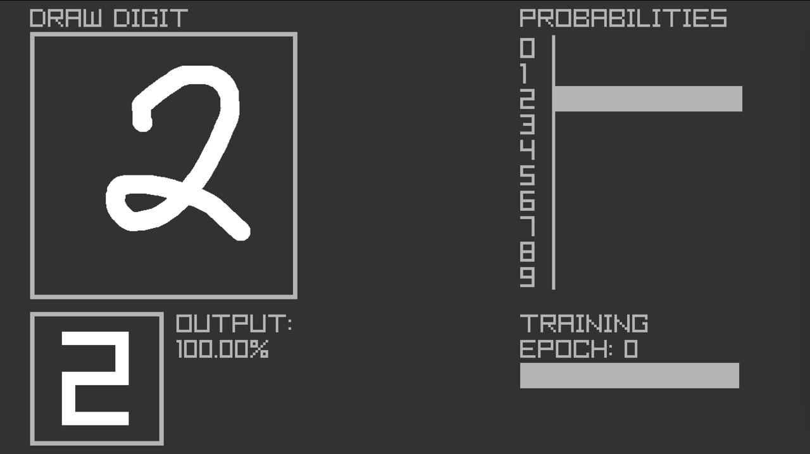

# Digit Recognition

Application to recognize handwritten digits. User can draw them with mouse cursor. MNIST dataset was used to train neural network. 

[Youtube video](https://youtu.be/eTcAwhPnnJA)

